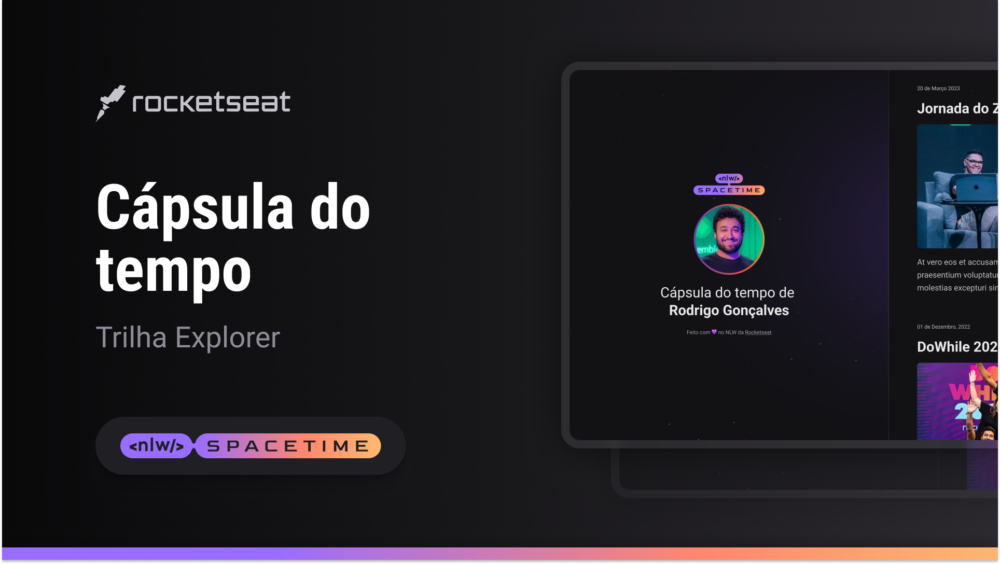

  

## 💻 Projeto
Esse é um projeto é uma cápsula do tempo para exibir memória em uma linha do tempo.

## 🚀 Tecnologias
Esse projeto foi desenvolvido durante a NLW da Rocketseat com as seguintes tecnologias:

- HTML
- CSS
- Git e Github

## 🏷️ Layout
Você pode visualizar o layout do projeto através
[desse link](https://www.figma.com/file/Xkcm8IFyj6Ny5IJZyekWSh/C%C3%A1psula-do-tempo-%E2%80%A2-Trilha-Explorer-(Emanuel)?type=design&node-id=306%3A84&t=TBzg1BQq6qxv4d7b-1). 
É necessário ter uma conta no [Figma](http://www.figma.com)